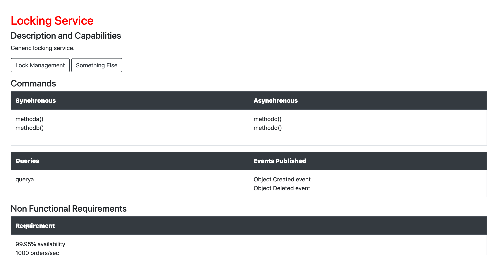

## Overview

Service map tool is a small tool for mapping out (micro) service architecture in terms of your API's, observability, implementation and dependency information.  This is useful during the early days of a project to decompose a monolith (for example).


## Instructions

1. Create a yml file in the format [domain]-service.yml. Copy the service-example.yml if needs be.

2. To process this and produce HTML documentation run:

make generate

and to serve this locally:

```
make start
```



# Service Template Editing

You can customise the template by  editing:

```
template/template.html
```